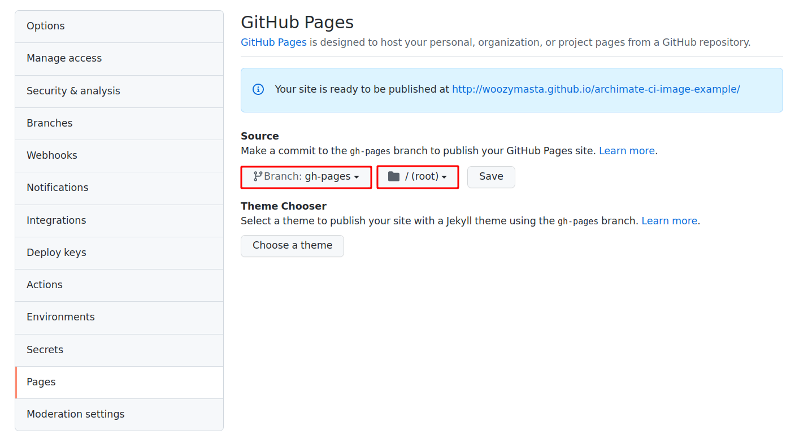

# Archimate container image for CI <!-- omit in toc -->

[Archi][Archi repository] container image for use in continuous integration
pipelines. With this container, you can implement automatic report generation
and model export in your pipeline.

The [Archi][] modelling toolkit is targeted toward all levels of Enterprise
Architects and Modellers.

For collaboration with models in the git repository, the [coArchi][] plugin
is installed in the container.

<!-- markdownlint-disable -->
<p align="center" width="100%">
  
</p>

For ease of use, the entrypoint.sh script is run in the container,
which processes the environment variables, and the native git client is used
for cloning.

## Table of Contents <!-- omit in toc -->

* [Examples and Demo](#examples-and-demo)
* [Container image](#container-image)
* [Run Container](#run-container)
* [Configuration](#configuration)
  * [GitHub Actions Configuration](#github-actions-configuration)
    * [Variables](#variables)
    * [Inputs](#inputs)
* [GitHub Actions Example](#github-actions-example)
* [GitLab CI Example](#gitlab-ci-example)
* [Build Container](#build-container)
* [Solving Potential Problems](#solving-potential-problems)

## Examples and Demo

[View GitHub Pages demo][demo-gh-pages] | [Example GitHub repository][example-gh]

[View GitLab Pages demo][demo-gl-pages] | [Example GitLab repository][example-gl]

## Container image

You can pull image from registries:

* `ghcr.io/woozymasta/archimate-ci-image:5.0.2-1.0.4`
* `docker.io/woozymasta/archimate-ci-image:5.0.2-1.0.4`

And rootless image:

* `ghcr.io/woozymasta/archimate-ci-image:5.0.2-1.0.4-rootless`
* `docker.io/woozymasta/archimate-ci-image:5.0.2-1.0.4-rootless`

## Run Container

Example with cloning a remote repository and render HTML report:

```bash
mkdir -p ./report
chmod o+rw ./report

docker run --rm -ti \
  -v $(pwd)/report:/archi/report \
  -e GIT_REPOSITORY=https://github.com/WoozyMasta/archimate-ci-image-example.git \
  -e ARCHI_HTML_REPORT_ENABLED=true \
  -e ARCHI_JASPER_REPORT_ENABLED=false \
  -e ARCHI_CSV_REPORT_ENABLED=true \
  -e ARCHI_EXPORT_MODEL_ENABLED=true \
  ghcr.io/woozymasta/archimate-ci-image:5.0.2-1.0.4
```

An example with handling a local repository:

```bash
cd /path/to/exist/repository
mkdir -p ./report
chmod o+rw ./report

docker run --rm -ti \
  -v $(pwd):/archi/project \
  -v $(pwd)/report:/archi/report \
  ghcr.io/woozymasta/archimate-ci-image:5.0.2-1.0.4
```

Working with the CLI directly:

```bash
docker run --rm -ti ghcr.io/woozymasta/archimate-ci-image:5.0.2-1.0.4 --help
```

## Configuration

Configuration for connecting to the git repository:

* **`GIT_REPOSITORY`** - Git repository address;
* **`GIT_TOKEN`** - Token for accessing the git repository. Preferred
  for private repositories, or use a key mounted in an ssh container;
* **`GIT_USERNAME`** - Username (_it is better to use token or ssh key_);
* **`GIT_PASSWORD`** - Password (_it is better to use token or ssh key_).

Options for managing model export:

* **`ARCHI_PROJECT_PATH`**=`/archi/project` - The path where the git repository
  with the architectural model will be cloned or connected;
* **`ARCHI_REPORT_PATH`**=`/archi/report` - Path where reports will be saved;
* **`ARCHI_HTML_REPORT_ENABLED`**=`true` - Generate HTML report;
* **`ARCHI_HTML_REPORT_PATH`**=`$ARCHI_REPORT_PATH/html` - Path for save HTML
  report;
* **`ARCHI_JASPER_REPORT_ENABLED`**=`false` - Generate Jasper reports;
* **`ARCHI_JASPER_REPORT_PATH`**=`$ARCHI_REPORT_PATH/jasper` - Path for save
  Jasper report;
* **`ARCHI_JASPER_REPORT_FORMATS`**=`PDF,DOCX` - Formats for Jasper reports
  should be separated by commas. Valid values: `PDF`, `HTML`, `RTF`, `PPT`,
  `ODT`, `DOCX`;
* **`ARCHI_JASPER_REPORT_TITLE`** - The title for the Jasper report, the
  default is the model/project name;
* **`ARCHI_CSV_REPORT_ENABLED`**=`false` - Generate CSV report;
* **`ARCHI_CSV_REPORT_PATH`**=`$ARCHI_REPORT_PATH/csv` - Path for save CSV
  report;
* **`ARCHI_EXPORT_MODEL_ENABLED`**=`true` - Export model in `*.archimate`
  format.
* **`ARCHI_EXPORT_MODEL_PATH`**=`$ARCHI_REPORT_PATH` - Path for save model;
* **`ARCHI_APP`**=`com.archimatetool.commandline.app` application name.
* **`DEBUG`**=`false` - enable `bash -x`

### GitHub Actions Configuration

#### Variables

* **`GITHUB_TOKEN`** - Use default token, or you can set some token from secrret `${{ secrets.ACCESS_TOKEN }}`
* **`GITHUB_SERVER_URL`**=`https://github.com` - GitHub server URL;
* **`GITHUB_PAGES_DOMAIN`** - Custom domain CNAME for pages;
* **`GITHUB_PAGES_BRANCH`**=`gh-pages` - Branch for store reports used in pages;
* **`GIT_SUBTREE_PREFIX`**=`.archi_report` - Directory for store reports in
  model branch.

#### Inputs

All inputs equivalent to environment variables:

* `githubToken` **required**
* `archiHtmlReportEnabled`
* `archiJasperReportEnabled`
* `archiJasperReportFormats`
* `archiJasperReportTitle`
* `archiCsvReportEnabled`
* `archiExportModelEnabled`
* `githubServerURL`
* `githubPagesDomain`
* `githubPagesBranch`
* `gitSubtreePrefix`
* `debugAction`

## GitHub Actions Example

Add a configuration like this to your actions `.github/workflows/main.yml` file:

```yml
jobs:
  archi_report:
    permissions:
      contents: write
      pages: write
    runs-on: ubuntu-latest
    name: Deploy Archi report HTML to GitHub Pages
    steps:
      - name: Check out the repo
        uses: actions/checkout@v2

      - name: Deploy Archi report
        id: archi
        uses: WoozyMasta/archimate-ci-image@5.0.2-1.0.4
        with:
          archiHtmlReportEnabled: true
          archiJasperReportEnabled: true
          archiJasperReportFormats: PDF,DOCX
          archiCsvReportEnabled: false
          archiExportModelEnabled: true
          githubToken: ${{ secrets.GITHUB_TOKEN }}
```

In the repository settings, set the branch for publishing pages that you
specified in `githubPagesBranch` or the `GITHUB_PAGES_BRANCH` variable
(`gh-pages` by default).



## GitLab CI Example

Add a configuration like this to your `./.gitlab-ci.yml` file:

```yml
pages:
  stage: build
  image:
    name: woozymasta/archimate-ci-image:5.0.2-1.0.4
    entrypoint: [""]

  script:
    - /opt/Archi/entrypoint.sh
    
  variables:
    ARCHI_HTML_REPORT_ENABLED: "true"
    ARCHI_JASPER_REPORT_ENABLED: "true"
    ARCHI_JASPER_REPORT_FORMATS: "PDF,DOCX"
    ARCHI_CSV_REPORT_ENABLED: "false"
    ARCHI_EXPORT_MODEL_ENABLED: "true"

  rules:
    - if: $CI_COMMIT_BRANCH != null || $CI_PIPELINE_SOURCE == "merge_request_event"
      exists:
        - model/folder.xml

  artifacts:
    name: "$CI_JOB_NAME from $CI_PROJECT_NAME on $CI_COMMIT_REF_SLUG"
    expire_in: 30d
    paths:
      - public
```

In GitLab CI if `ARCHI_PROJECT_PATH` is undefined is set to `$CI_PROJECT_DIR`
and all report paths are automatically set to `$CI_PROJECT_DIR/public`

## Build Container

```bash
ARCHI_VERSION=5.0.2
COARCHI_VERSION=0.8.7

docker build \
  --tag "archimate-ci-image:$ARCHI_VERSION-dev" \
  --build-arg="ARCHI_VERSION=$ARCHI_VERSION" \
  --build-arg="COARCHI_VERSION=$COARCHI_VERSION" \
  ./

docker build \
  --file Dockerfile.rootless \
  --tag "archimate-ci-image:$ARCHI_VERSION-dev-rootless" \
  --build-arg="ARCHIMATE_CI_IMAGE=archimate-ci" \
  --build-arg="ARCHIMATE_CI_VERSION=$ARCHI_VERSION-dev" \
  ./
```

## Solving Potential Problems

If you use podman, unshare mounted volumes to user with id 1000.

```bash
mkdir -p ./report

podman unshare chown 1000 -R $(pwd)/model
podman run --rm -ti \
  -v $(pwd)/report:/archi/report \
  -e GIT_REPOSITORY=https://github.com/WoozyMasta/archimate-ci-image-example.git \
  -e ARCHI_JASPER_REPORT_ENABLED=false \
  ghcr.io/woozymasta/archimate-ci-image:5.0.2-1.0.4
```

---

If you are using a private git repository hosted behind a VPN, the tunnel
interface or name resolution might not be available in the container, use the
host network in the container and force the DNS record forward.

```bash
docker run --rm -ti \
  -v $(pwd)/archi:/archi \
  -e GIT_REPOSITORY=https://github.com/WoozyMasta/archimate-ci-image-example.git
  --network=host
  --add-host="$(getent hosts gitlab.internal.tld | awk '{print $2 ":" $1}')"
  ghcr.io/woozymasta/archimate-ci-image:5.0.2-1.0.4
```

<!-- links -->

[Archi]: https://www.archimatetool.com "The Open Source modelling toolkit for creating ArchiMate models and sketches."
[Archi repository]: https://github.com/archimatetool/archi "Archi: ArchiMate Modelling Tool"
[coArchi]: https://github.com/archimatetool/archi-modelrepository-plugin "coArchi – Model Collaboration for Archi"

[example-gh]: https://github.com/WoozyMasta/archimate-ci-image-example.git
[demo-gh-pages]: https://woozymasta.github.io/archimate-ci-image-example/?view=6213
[example-gl]: https://gitlab.com/WoozyMasta/archimate-ci-image-example
[demo-gl-pages]: https://woozymasta.gitlab.io/archimate-ci-image-example/?view=6213
